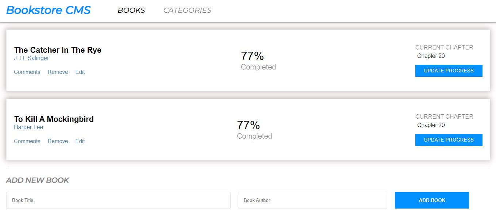

# Bookstore CMS
The Bookstore is a website that helps you;
- Display a list of books.
- Add a book.
- Remove a selected book.


## Built With
- JSX
- HTML5
- CSS3
- React

## installation

To get a local copy up and running follow these simple example steps.

- clone the repository by running
``` https://github.com/Christianib003/Bookstore_react.git ```
- navigate to the folder
``` cd <DIRECTORY> ```
- Install packages
``` npm i ```
- Run the app
``` npm start ```


The page will be opened in your browser

### Run linter tests

- To run linter tests run :
- npx stylelint "**/*.{css,scss}"
- npx eslint .

## Authors
**Author 1**
- Github: [Christianib003](https://github.com/Christianib003)
- LinkedIn: [@Christian Iradukunda Byiringiro](https://www.linkedin.com/in/christian-iradukunda-byiringiro-657598226)

## 🤝 Contributing

Contributions, issues, and feature requests are welcome!

Feel free to check the [issues page](https://github.com/Christianib003/Bookstore_react/issues).
## :memo: License
This project is [MIT](./MIT.md) licensed.